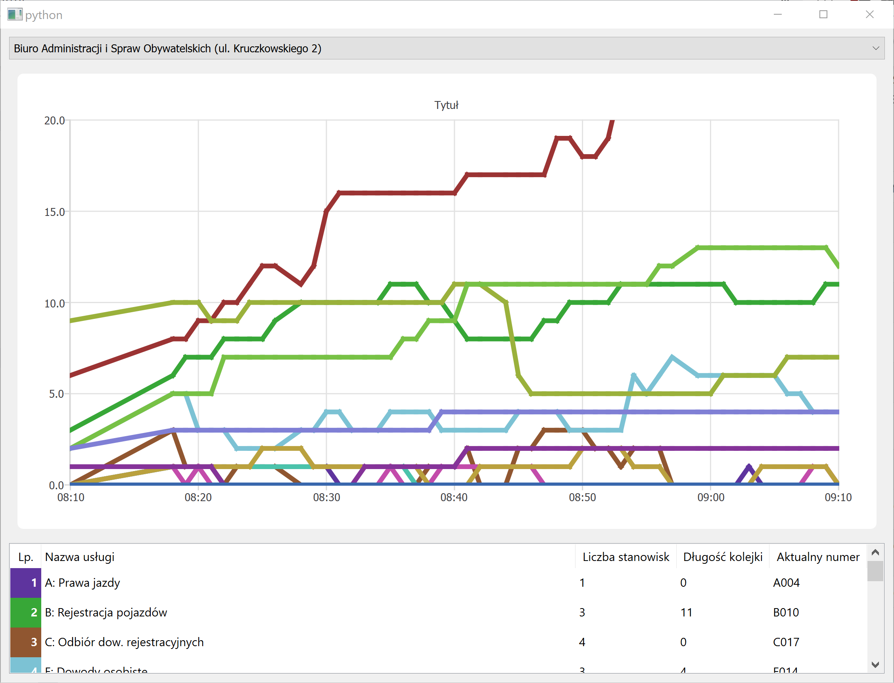

# systemy-kolejkowe

Prezentacja bieżących danych z systemów kolejkowych jednostek Urzędu m.st. Warszawy i Dzielnic.    
Projekt zrealizowany został w języku Python w ramach przedmiotu "Podstawy informatyki i programowania" w pierwszym semestrze 2019/20.

# Interfejs graficzny

Aplikacja po wybraniu urzędu z listy pokazuje aktualny stan jego systemu kolejkowego.    
Na wykresie liniowym wizualizowana jest zmiana liczebności kolejek w czasie.    
Pod wykresem znajduje się spis możliwych do załatwienia w wybranym urzędzie spraw wraz z bieżącymi danymi na temat kolejek z nimi powiązanych.

# Funkcjonalność
- wyświetlanie listy dostępnych urzędów
- wyświetlanie listy wszystkich rodzajów spraw możliwych do załatwienia w danym urzędzie
- wyświetlenie aktualnego stanu kolejki dla danej sprawy w urzędzie (liczba stanowisk, liczba osób w kolejce, aktualny numer)
- aktywne monitorowanie aktualnego stanu kolejki dla wybranych grup urzędowych w wybranych urzędach (dopuszczalny interfejs konsolowy, ale lepszy byłby graficzny lub webowy)
- wizualizacja monitorowanego stanu kolejki na wykresie z seriami (np. z użyciem pyplot). Oś X - czas; oś Y - liczba osób w kolejce; każda grupa urzędowa to oddzielna seria
- lokalne cache'owania pobieranych wyników (w celu ograniczenia liczby dostępów do API, pytanie o te same dane nie powinno być zadawane częściej niż co 30 sekund)